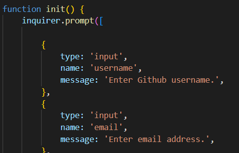

# READMEGenerator

 

<h3 align="center">README Generator</h3>

  

    Command Prompt-based README Generator
     
  

  
Table of Contents

  <ol>
    <li><a href="#about-the-project">About The Project</a></li>
    <li><a href="#tools">Tools</a></li>
    <li><a href="#instructions">Instructions</a></li>
    <li><a href="#usage">Usage</a></li>
    <li><a href="#license">License</a></li>
    <li><a href="#contact">Contact</a></li>
  </ol>

## About The Project

The motivation behind this project is to create an efficient and intuitive method of producing quility README files for any project repository. 

The README generator utilizes Inquire.js to prompt users with a series of questions related to their project. Once these answers are provided, the application then produces a README file based on the responses. 

(<a href="#top">back to top</a>)

### Tools

* JavaScript
* Node.js

(<a href="#top">back to top</a>)

## Instructions

Follow the instructions below to generate custom README files: 

- You will need to download the repository files to your local machine. 
- Open the command prompt and navigate to the folder labeled "Develop" within the repository.
- Type the following into the command prompt 'npm init -y' followed by 'npm install' to install the required modules.
- Then type the following into the command prompt 'node index.js' to run the README generator.
- You will then be presented with a series of questions about your project.
- Once these questions are answered, a README file tited <i>ResultREADME.md </i> will be generated and added to the repository folder. 

## Usage

Refer to video linked below for a working demonstration of the application:

(<a href="#top">back to top</a>)

## License

Distributed under the MIT License. See `LICENSE.txt` for more information.

(<a href="#top">back to top</a>)

## Contact

Henry Nguyen -  hln11244@gmail.com

Repository Link: [https://github.com/henry11244/ReadMeGenerator](https://github.com/henry11244/ReadMeGenerator)

linkedIn: https://www.linkedin.com/in/henry11244/

(<a href="#top">back to top</a>)

